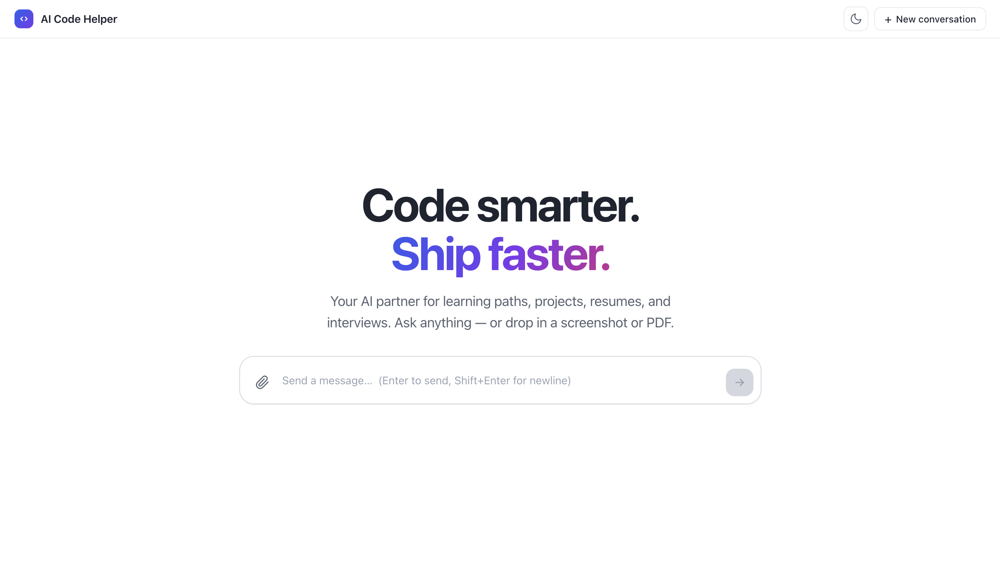
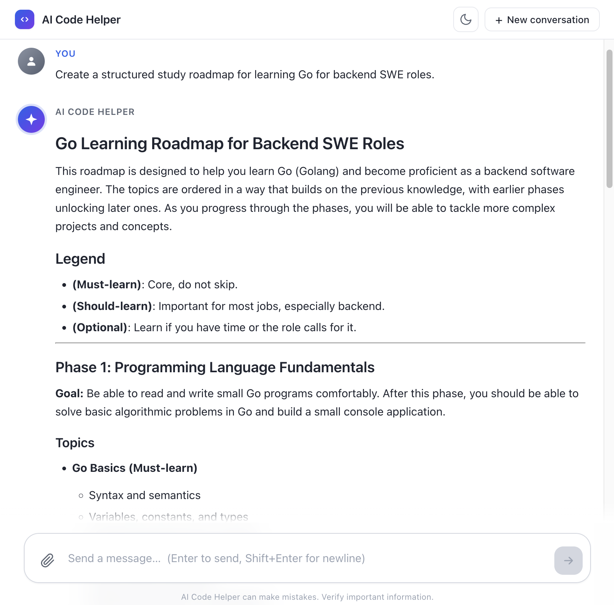
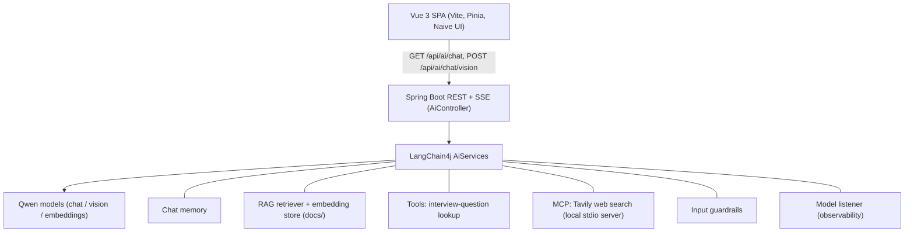

# AI Code Helper

An AI programming mentor, job-prep assistant, and code Q&A companion. It pairs a streaming
Spring Boot + LangChain4j backend (Alibaba Qwen models) with a polished Vue 3 chat interface that
supports image/PDF uploads, retrieval over a local knowledge base, live web search, and light/dark
themes.

[](https://spring.io/projects/spring-boot)
[](https://www.oracle.com/java/)
[](https://github.com/langchain4j/langchain4j)
[](https://vuejs.org/)
[](https://vitejs.dev/)

---

## Screenshots

| Landing | Conversation |
| --- | --- |
|  |  |

---

## Overview

AI Code Helper is built around three roles:

- **Learning mentor** — generates structured study roadmaps and personalized guidance.
- **Job-prep assistant** — resume feedback, interview techniques, and high-frequency questions.
- **Code Q&A companion** — answers technical questions with formatted, syntax-highlighted code.

Answers stream token by token. Users can attach a screenshot or PDF (for example a resume or an
error message) and ask about it, and the assistant can pull in fresh information from the web and a
local document set when it helps.

---

## Features

- **Streaming responses** over Server-Sent Events with a smooth typewriter effect.
- **Multimodal chat** — upload an image (PNG/JPEG/WebP) or a PDF and ask questions about it.
- **Live web search** through a Model Context Protocol (MCP) tool.
- **Interview-question lookup** via a custom tool.
- **Retrieval-augmented answers** grounded in a local knowledge base.
- **Markdown rendering** with code syntax highlighting and per-block copy.
- **Light and dark themes** that follow the system preference and persist across reloads.
- **Reliable completion** — a reply is only marked complete once the server signals end-of-stream,
  so interrupted responses surface a retry instead of silently truncating.

---

## AI capabilities (LangChain4j)

The backend uses LangChain4j's high-level `AiServices` and demonstrates the major building blocks
of a production AI application:

| Capability | What it does | Where |
| --- | --- | --- |
| Streaming chat | Token streaming as a reactive `Flux`, served over SSE | `AiCodeHelperService`, `AiController` |
| Multimodal vision | Image/PDF questions answered by `qwen-vl-max` | `AiCodeHelper`, `FileToImageContent` |
| Chat memory | Per-session sliding window (last 10 messages) keyed by memory id | `AiCodeHelperServiceFactory` |
| Structured output | Model output mapped into a typed Java record | `AiCodeHelperService` |
| RAG | Local documents embedded and retrieved to ground answers | `RagConfig` |
| Tool calling | A custom interview-question tool the model can invoke | `InterviewQuestionTool` |
| MCP tools | External tools (web search) over the Model Context Protocol | `McpConfig` |
| Input guardrails | Blocks unsafe input before it reaches the model | `SafeInputGuardrail` |
| Observability | Hooks into model request/response lifecycle events | `ChatModelListenerConfig` |

Retrieval uses paragraph-level chunking (1500 characters, 300 overlap), Qwen embeddings, and a
top-5 retriever with a 0.75 minimum similarity score. Web search runs through a local Tavily MCP
server that the backend launches on startup.

---

## Tech stack

**Backend**

| Component | Version |
| --- | --- |
| Java | 21 |
| Spring Boot | 3.5.14 |
| LangChain4j (core, MCP, reactor, DashScope starter) | 1.1.0 / 1.1.0-beta7 |
| Apache PDFBox (PDF rendering for vision) | 3.0.3 |
| jsoup (HTML parsing for tools) | 1.20.1 |
| Build | Maven (wrapper included) |

**Frontend**

| Component | Version |
| --- | --- |
| Vue | 3.5 |
| TypeScript | 5.7 |
| Vite | 6 |
| Pinia (state) | 2 |
| Naive UI | 2.40 |
| markdown-it + highlight.js | 14 / 11 |

**Models (Alibaba Cloud DashScope / Qwen)**

| Purpose | Model |
| --- | --- |
| Chat and streaming chat | `qwen-max` |
| Vision (image/PDF) | `qwen-vl-max` |
| Embeddings (RAG) | `text-embedding-v4` |

---

## Architecture



---

## Project structure

```
ai-code-helper/
├── src/main/java/com/andy/aicodehelper/
│   ├── controller/AiController.java          # SSE chat + vision endpoints
│   ├── ai/
│   │   ├── AiCodeHelperService.java          # AiService interface (chat, RAG, structured, stream)
│   │   ├── AiCodeHelperServiceFactory.java   # wires model + memory + RAG + tools + MCP
│   │   ├── AiCodeHelper.java                 # vision streaming helper
│   │   ├── model/QwenChatModelConfig.java    # qwen-max chat model
│   │   ├── model/QwenVisionModelConfig.java  # qwen-vl-max streaming vision model
│   │   ├── rag/RagConfig.java                # document ingestion + retriever
│   │   ├── mcp/McpConfig.java                # Tavily MCP tool provider
│   │   ├── tools/InterviewQuestionTool.java  # tool calling
│   │   ├── guardrail/SafeInputGuardrail.java # input safety
│   │   ├── listener/ChatModelListenerConfig.java
│   │   └── vision/FileToImageContent.java    # image/PDF -> model content
│   └── config/CorsConfig.java
├── src/main/resources/
│   ├── application.yaml                       # config (placeholders)
│   ├── application-local.yaml                 # local profile (your API keys)
│   ├── system-prompt.txt                      # assistant system prompt
│   └── docs/                                  # knowledge base for RAG
└── ai-code-helper-frontend/
    └── src/                                   # Vue app (views, components, stores, composables)
```

---

## Getting started

### Prerequisites

- **JDK 21+**
- **Node.js 18+ and npm** — required both for the frontend and for the Tavily MCP server, which
  the backend starts with `npx`.
- **A DashScope (Qwen) API key** — https://dashscope.console.aliyun.com/
- **A Tavily API key** — https://tavily.com/ (used for web search via MCP)

### 1. Configure API keys

Put your keys in `src/main/resources/application-local.yaml` (the active `local` profile). Set the
key for each model block and the Tavily key:

```yaml
langchain4j:
  community:
    dashscope:
      chat-model:
        base-url: https://dashscope-intl.aliyuncs.com/api/v1
        model-name: qwen-max
        api-key: <your-dashscope-key>
      embedding-model:
        base-url: https://dashscope-intl.aliyuncs.com/api/v1
        model-name: text-embedding-v4
        api-key: <your-dashscope-key>
      streaming-chat-model:
        base-url: https://dashscope-intl.aliyuncs.com/api/v1
        model-name: qwen-max
        api-key: <your-dashscope-key>
      vision-streaming-chat-model:
        base-url: https://dashscope-intl.aliyuncs.com/api/v1
        model-name: qwen-vl-max
        api-key: <your-dashscope-key>
tavily:
  api-key: <your-tavily-key>
```

Do not commit real keys. Keep them in `application-local.yaml` and add that file to `.gitignore`.

### 2. Run the backend

```bash
./mvnw spring-boot:run
```

The API serves at `http://localhost:8081/api`. On first start it ingests the documents under
`src/main/resources/docs` for RAG and launches the local Tavily MCP server via `npx`.

### 3. Run the frontend

```bash
cd ai-code-helper-frontend
npm install
npm run dev
```

Open `http://localhost:5173`. The dev server proxies `/api` to the backend on port 8081.

---

## API endpoints

Both endpoints stream `text/event-stream` and finish with an `event: done` marker.

| Method | Path | Body / params | Purpose |
| --- | --- | --- | --- |
| `GET` | `/api/ai/chat` | `memoryId` (int), `message` (string) | Text chat with memory |
| `POST` | `/api/ai/chat/vision` | multipart: `message`, `file` | Image/PDF (multimodal) chat |

---

## Acknowledgements

- [LangChain4j](https://github.com/langchain4j/langchain4j) — Java framework for LLM applications
- [Alibaba Cloud Qwen / DashScope](https://dashscope.aliyun.com/) — language, vision, and embedding models
- [Tavily](https://tavily.com/) — web search via MCP
- [Spring Boot](https://spring.io/projects/spring-boot)
- [Vue](https://vuejs.org/) and [Naive UI](https://www.naiveui.com/)
